# 1️⃣ Prérequis
Avant de commencer, assurez-vous d'avoir installé :

    🐳 Docker
    📦 Docker Compose
    🐫 Elastisearch, Kibana et Logstash


## 2️⃣ Lancer les services:

💡 Créez un fichier docker-compose.yml avec le contenu suivant : :
```bash
version: '3.7'
services:
  elasticsearch:
    image: docker.elastic.co/elasticsearch/elasticsearch:8.11.0
    container_name: elasticsearch
    environment:
      - discovery.type=single-node
      - xpack.security.enabled=false
      - "ES_JAVA_OPTS=-Xms512m -Xmx512m"
    ports:
      - "9200:9200"
    networks:
      - elk

  logstash:
    image: docker.elastic.co/logstash/logstash:8.11.0
    container_name: logstash
    volumes:
      - ./logstash.conf:/usr/share/logstash/pipeline/logstash.conf
      - ./logs:/usr/share/logstash/logs
    environment:
      - "LS_JAVA_OPTS=-Xms512m -Xmx512m"
    depends_on:
      - elasticsearch
    ports:
      - "5044:5044"
      - "5000:5000/tcp"
      - "5000:5000/udp"
      - "9600:9600"
    networks:
      - elk

  kibana:
    image: docker.elastic.co/kibana/kibana:8.11.0
    container_name: kibana
    environment:
      - ELASTICSEARCH_HOSTS=http://elasticsearch:9200
    ports:
      - "5601:5601"
    depends_on:
      - elasticsearch
    networks:
      - elk

networks:
  elk:
    driver: bridge
```
💡 Créez un fichier logstash.conf avec le contenu suivant : 

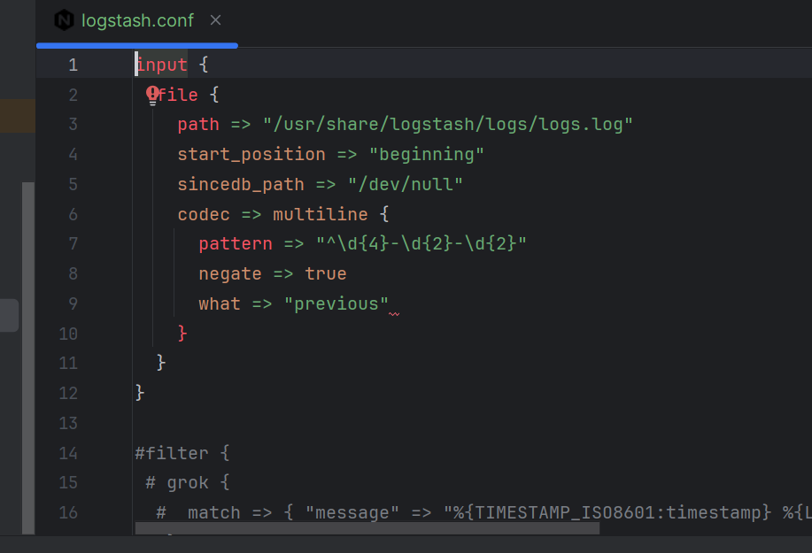


## Building

➤ Lancer cette commande :

```bash
docker compose up
```
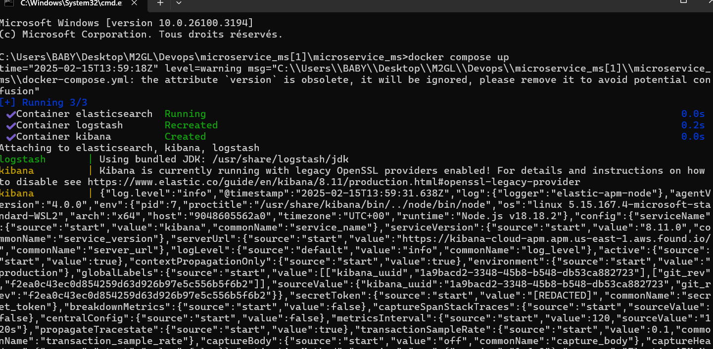


➤ Les conteneurs sont en cours d'execution :

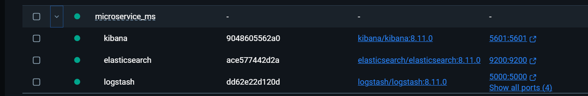

🔍 Accés à Kibana et configuration des logs:
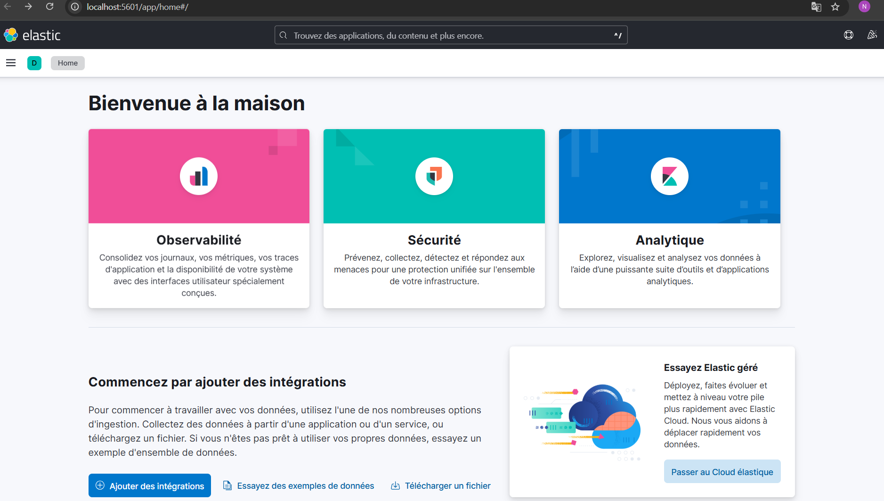

➤ Cliquez sur "Sample Web Logs"
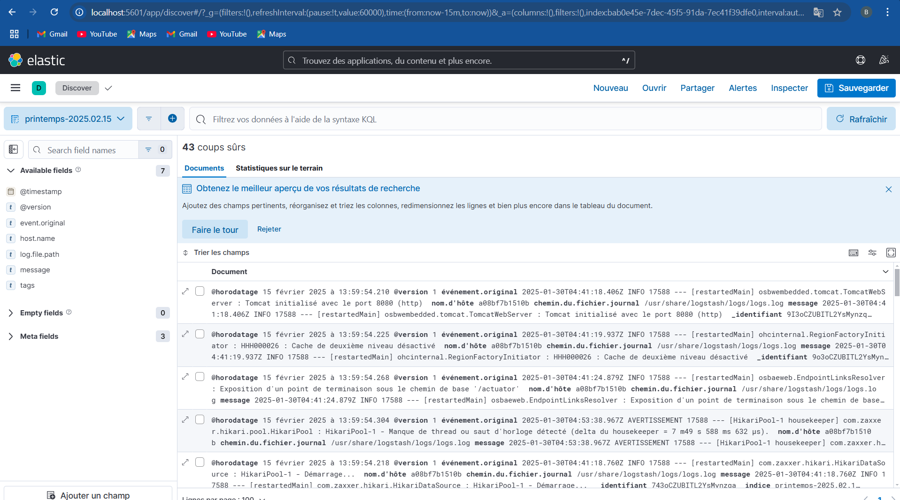

➤ Allez dans Management > Settings et éditez le Data View
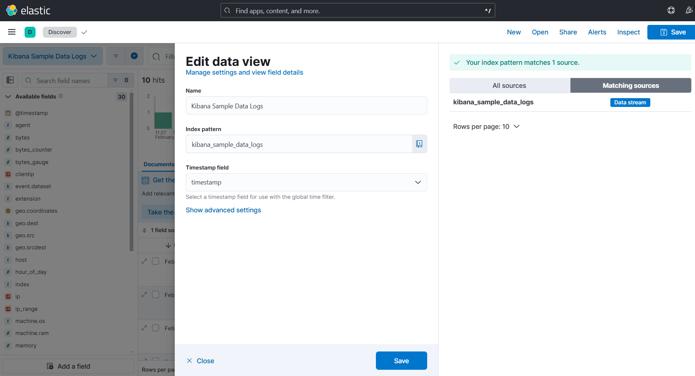

➤ Vous verrez maintenant les logs de votre application
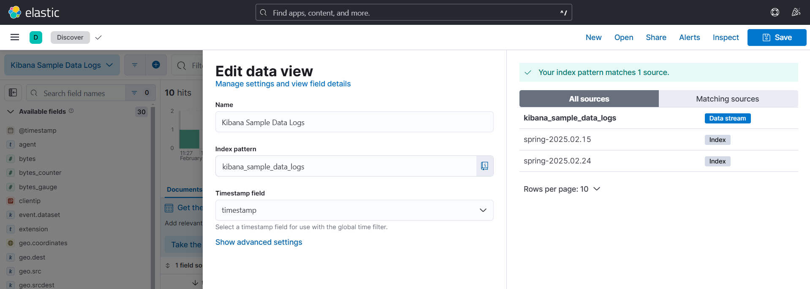

📊 Vérifier l'Index Management:

➤ Accédez à la section Index Management pour valider vos données :
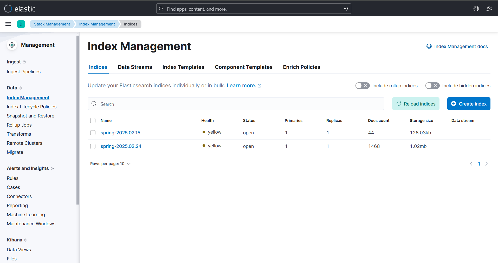
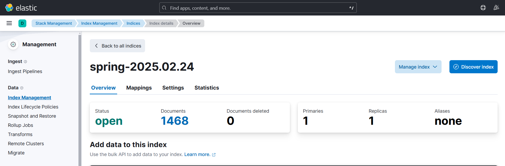

✅ Visualiser les logs de l'application:

➤ Vous pouvez désormais voir les logs générés par votre application :

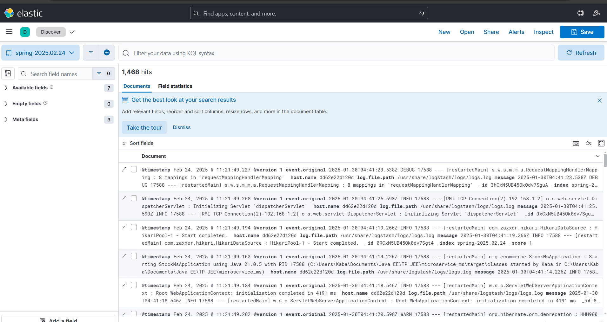
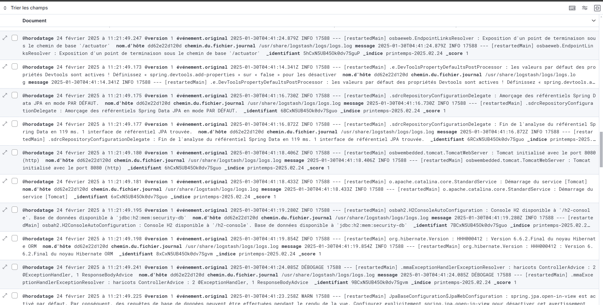

